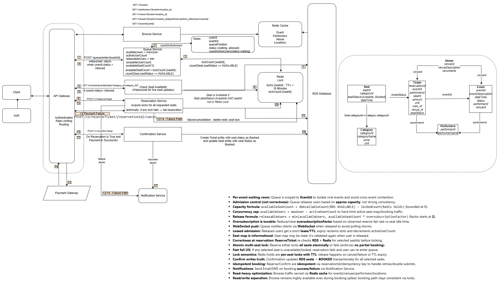
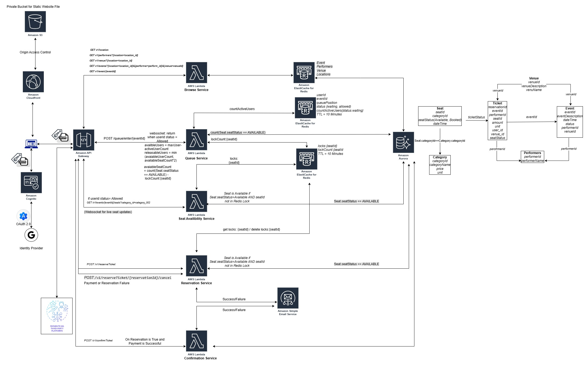

# Online Ticket System


## Table of Contents
- [0. Overview](#overview)
- [1. IMPORTANT - WHY THIS LIGHT BRANCH EXISTS](#important---why-this-light-branch-exists)
- [2. Problem Statement](#problem-statement)
- [3. Objectives](#objectives)
- [4. Functional Scope](#functional-scope)
- [5. Non Functional Design Principals](#non-functional-design-principles)
- [6. AWS High Level Architecture](#aws-high-level-architecture)
- [7. Service Architecture](#service-architecture)
- [8. Consistency Model](#consistency-model)
- [9. Data Model](#data-model)
- [10. End to End Flow](#end-to-end-flow)
- [11. Booking token](#booking-token)
- [12. Reservation Contract](#reservation-contract)
- [13. Payment Contract](#payment-contract)
- [14. Booking Confirmation Contract](#booking-confirmation-contract)
- [15. Faliure Handling](#failure-handling)
- [16. Security Model](#security-model)
- [17. Infrastructure Layout](#infrastructure-layout)
- [18. Database Bootstrap](#database-bootstrap)
- [19. Deployment Process](#deployment-process)
- [20. Local Developement Notes](#local-development-notes)
- [21. Known Design Choices and TradeOfss](#known-design-choices)
- [22. Operational Notes](#operational-notes)
- [23. Future Improvements](#future-improvements)
- [24. Conclusion](#conclusion)


## Overview

This project is a cloud-native online ticketing platform designed for high-demand event booking scenarios where seat contention, fairness, and booking correctness matter more than raw CRUD simplicity. The system is built to support browsing events, filtering by location and venue, queue-based admission control, seat map retrieval, reservation with atomic seat locking, payment handoff, and booking confirmation. The design assumes that many users can request the same seats concurrently and that the system must prevent double booking without turning the database into a lock manager.

The core design principle is a strict separation between long-lived truth and short-lived coordination. The database is the source of truth for only two seat states: `AVAILABLE` and `BOOKED`. Temporary holds are not stored in the database. Seat locks are maintained entirely in cache with TTL. This allows abandoned flows to expire naturally without requiring cleanup jobs to revert database state. The result is a design where cache controls short-lived reservation windows and the database records only durable business outcomes.

The platform is implemented on AWS using a serverless-first model. Lambda functions host business services. Aurora PostgreSQL stores durable state. RDS Proxy is used for database connectivity with IAM authentication. ElastiCache Serverless for Valkey is used for queue state, browse caching, and seat lock state. API Gateway REST APIs expose the endpoints. Cognito secures user-facing APIs. KMS is used for signing and verifying the booking token issued by the queue service. Terraform is used to provision and manage the infrastructure.

This repository is not a toy booking example. It is designed around the practical problems that appear in real ticketing systems: concurrent seat requests, queue admission, replay safety, reservation expiry, cache-only lock semantics, and delayed payment confirmation.




## IMPORTANT - WHY THIS LIGHT BRANCH EXISTS

The main branch uses the following database connectivity architecture:

```text
AWS Lambda → RDS Proxy → Aurora Serverless v2
```

This is a production-oriented design that provides:

- Connection pooling
- Connection multiplexing
- Improved handling of Lambda connection bursts
- Managed failover support
- End-to-end IAM authentication

While this architecture is technically robust, it introduces additional operational costs.

### The Cost Challenge

This project is a personal portfolio project with very low and infrequent traffic. There are no real users generating sustained load, and the database workload consists primarily of occasional testing and demonstrations.

Aurora Serverless v2 has been configured to auto-pause after 10 minutes of inactivity to minimize costs. However, when an RDS Proxy is associated with the Aurora cluster, the proxy maintains database connections and prevents the cluster from reaching its lowest-cost idle state.

As a result:

- RDS Proxy incurs its own charges.
- Aurora remains active due to the proxy association.
- The overall database cost is higher than necessary for a low-traffic portfolio project.

### What Changed in This Branch

This branch removes the RDS Proxy layer and connects AWS Lambda directly to Aurora Serverless v2 using IAM database authentication.

The architecture becomes:

```text
AWS Lambda → Aurora Serverless v2
```

Changes include:

- Removal of RDS Proxy resources.
- Direct Lambda-to-Aurora connectivity.
- Direct IAM database authentication.
- Updated security group configuration.
- Updated Lambda database connection logic.

### Why This Approach Is Acceptable

The primary reason for using RDS Proxy is to handle large numbers of concurrent database connections efficiently.

For this project:

- Traffic volume is extremely low.
- Concurrent database connections are minimal.
- Aurora can comfortably handle the expected workload without a proxy layer.

The architectural trade-off is therefore reasonable:

- Lower infrastructure cost.
- Simpler deployment model.
- Aurora auto-pause functionality can be fully utilized.
- Slightly reduced scalability compared to the production-oriented proxy design.

### Important Note

This branch is intended for cost-optimized operation of the portfolio project.

The main branch remains the reference implementation for a production-style architecture that includes RDS Proxy and demonstrates best practices for serverless database connectivity at scale.

This branch prioritizes cost efficiency, while the main branch prioritizes architectural completeness.

---

## Problem Statement

Traditional booking systems fail under contention because they try to use the database for everything. That becomes expensive and brittle when thousands of users target the same event and the same category of seats. Holding seats in the database also introduces operational complexity. If a user drops out after selecting seats but before payment, the system must explicitly release those holds. If that release flow fails, inventory becomes artificially blocked.

This project avoids that design. The database continues to hold only durable seat status. Temporary reservation state exists in cache and expires automatically. This makes the system operationally cleaner and closer to how ticketing flows actually behave. A seat is only considered truly sold when confirmation succeeds and the booking service commits the seat update to the database.

The queue service introduces controlled admission. Not every user reaching the seat map endpoint is immediately allowed to compete for seats. Users are admitted in a bounded manner per event and category. This protects the booking flow from becoming a free-for-all under load. Reservation then becomes the first point at which seats are actually locked. Seat Availability service only displays the current state. It does not create locks. Payment is external and amount-based. Booking confirmation is the only service that transitions seats to `BOOKED`.


---

## Objectives

The project is designed around the following objectives.

- Provide a clean browse experience for locations, venues, performers, events, and event details.
- Enforce fair admission through a queue service before users reach the seat map.
- Show seat maps that reflect live state using both database truth and cache-derived locks.
- Guarantee atomic multi-seat reservation with all-or-none locking.
- Keep temporary holds out of the database.
- Treat payment as an external concern that is linked only by reservation identifier and amount.
- Make booking confirmation the only step that changes durable seat state.
- Use infrastructure patterns that are deployable, repeatable, and production-aligned.
- Keep service responsibilities explicit and avoid hidden coupling.

---

## Functional Scope

The current system covers the following capabilities.


### Browse

Users can retrieve:
- locations
- venues for a location
- performers for a location
- events for a location
- event details including category pricing and seat map endpoint reference

### Queue

Users request entry into an event and category specific queue. The queue either admits the session immediately or places the session into a waiting state. The queue issues a booking token for subsequent services. This token is the service-to-service proof that the user has passed through queue admission.

### Seat Availability

Users who are admitted can retrieve the seat map for an event and category. The service shows:
- `AVAILABLE` when the seat is available in DB and not locked in cache
- `LOCKED` when the seat is available in DB but currently locked in cache
- `BOOKED` when the seat is booked in DB

This service is read-only. It does not lock seats.

### Reservation

Users submit selected seats to the reservation service. The reservation service:
- re-checks queue admission
- verifies the booking token
- validates the seats are available in DB
- acquires all seat locks atomically in cache
- returns reservation identifier, amount, currency, expiry, and lock result

Reservation is all-or-none. Partial reservation is intentionally not supported.

### Payment

Payment is external. The platform hands off `reservationId` and `totalAmount` to an external payment service. Payment does not know about seat identities. It only cares about the amount against the reservation.

### Booking Confirmation

After successful payment, the confirmation service:
- validates that the reservation still exists
- validates the reservation locks still exist
- validates the payment result
- re-checks DB seats are still available
- books seats in DB
- inserts tickets
- cleans up reservation and lock keys from cache

---

## Non Functional Design Principles

### Database stores only durable business truth

The database does not track transient seat holds. This is deliberate. The database stores:
- `AVAILABLE`
- `BOOKED`

Nothing in the browse or seat map flow should infer `LOCKED` from the database.

### Cache stores all short-lived coordination state

Queue admission state, reservation seat mapping, reservation metadata, and seat locks are kept in Valkey with TTL. If the user abandons the journey, these records expire naturally.

### All multi-seat lock operations are atomic

Reservation locking must succeed for every requested seat or fail for all seats. This is implemented using Lua in Valkey with cluster-safe key design.

### Confirmation is the only place that updates seats to BOOKED

This makes the booking path clear. Reservation holds. Confirmation books.

### Services do one thing only

Each Lambda has a single primary responsibility. Browse does not know about queue. Seat availability does not lock. Payment does not inspect seats. Confirmation does not decide pricing.

---

## AWS High Level Architecture

The system is composed of the following major components.



### API Gateway REST API

API Gateway exposes public endpoints and forwards requests to Lambda functions using proxy integration. REST API was chosen over HTTP API in this project because the event shape and authorizer integration were already aligned to the service implementations.

### Cognito

Cognito secures user-facing APIs. Service code reads the authenticated user from `requestContext.authorizer.claims.sub` in the API Gateway REST event.

### Lambda Services

Each service is implemented as a separate Lambda function.

- Browse Service
- Queue Service
- Seat Availability Service
- Reservation Service
- Payment Mock Service
- Booking Confirmation Service

### Aurora PostgreSQL

Aurora PostgreSQL stores all durable state:
- locations
- venues
- performers
- events
- event categories
- seats
- reservation audit
- tickets

### RDS Proxy

All Lambdas that need database access connect through RDS Proxy using IAM authentication. This reduces connection churn and avoids storing DB passwords.

### ElastiCache Serverless for Valkey

The project uses separate cache responsibilities.

- Browse cache for read-heavy browse endpoints
- Queue cache for queue waiting list, allowed sessions, and active counts
- Seat lock cache for reservation seat locks and reservation metadata

### KMS

KMS signs and verifies the booking token issued by queue service. This allows later services to trust queue admission without sharing symmetric secrets.

### SNS

Booking confirmation can publish best-effort notifications after a successful or failed booking workflow.

### Terraform

Infrastructure is managed using Terraform modules for networking, database, cache, and compute.

---

## Service Architecture

## Browse Service

Browse service is the entry point for discovery. It serves locations, venues, performers, events, and event detail payloads. It uses Aurora PostgreSQL through RDS Proxy and optionally caches responses in Valkey. Browse is read-only. It does not know anything about queue admission or locks.

The service uses two layers of caching:
- local in-memory warm Lambda cache
- distributed browse cache in Valkey with TTL

This allows repeated browse requests to avoid unnecessary database reads while still keeping the system stateless across cold starts.

## Queue Service

Queue service controls admission to the seat map. It is the service that limits the number of simultaneously active users for a given event and category. The queue maintains waiting sessions and allowed sessions in cache. It signs a booking token using KMS. That token carries:
- user identifier
- event identifier
- category identifier
- session identifier
- issue and expiry times
- scope

The booking token is the platform’s internal proof that a user passed admission control. Later services verify this token before proceeding.

Queue state is not stored in the database. Queue is purely cache-driven.

## Seat Availability Service

Seat Availability service is deliberately read-only. It does not try to reserve or lock anything. It returns the seat map for one event and one category by combining two sources:
- database truth for `AVAILABLE` and `BOOKED`
- seat lock cache for `LOCKED`

This service is intentionally simple because it is frequently called by the client. The first state transition should not happen here. Lock creation belongs to Reservation Service.

## Reservation Service

Reservation is the first service that actually changes seat contention state. It checks:
- user identity
- booking token validity
- queue allowed session
- seat availability in DB

Then it acquires locks in cache using atomic all-or-none logic. Reservation also writes:
- seat list for the reservation
- reservation metadata containing price, quantity, amount, and expiry
- reservation lookup key by reservation identifier

These records are stored in cache only and expire together. This is what allows payment and confirmation to operate without DB holds.

Reservation writes failed attempts to the `reservations` table for audit. It does not create a database hold for successful reservations.

## Payment Mock Service

Payment is modeled as an external third-party system. The mock service exists only to simulate that interaction. It accepts:
- reservation identifier
- total amount

It returns success or failure. It does not know anything about event, category, or seat identity.

This is exactly how the rest of the platform treats payment. Payment is amount-based, not seat-aware.

## Booking Confirmation Service

Booking confirmation is the durable commit point of the business flow. It validates:
- booking token
- reservation lookup metadata
- reservation seat list
- payment status
- reservation amount
- lock ownership
- seat availability in DB

Then, in one database transaction, it:
- updates seats to `BOOKED`
- inserts tickets

After successful commit it deletes the cache keys associated with the reservation and its locks. It can also publish an SNS event.

This service is intentionally strict. If any condition fails, booking fails. No partial booking is allowed.

---

## Consistency Model

The project uses a hybrid consistency approach.

### Database consistency

The database is used for durable and authoritative states only. The most important rule is that `BOOKED` lives only in the database. Once booking confirmation commits, the seat is sold.

### Cache consistency

Cache is used for:
- short-lived queue admission
- short-lived reservation state
- short-lived seat locks

Cache is allowed to expire data naturally. This is not a weakness in this system. It is a design choice. A reservation that expires should stop existing without DB cleanup.

### Why this split matters

If seat locks were stored as holds in DB, abandoned reservations would force DB cleanup or background reconciliation. In this project, a user can reserve seats and disappear before payment. The lock TTL handles that automatically. The seat reappears as available once the cache lock expires.

This means the system accepts dependency on cache for transient coordination, while protecting durable booking correctness in DB.

---

## Cache Key Design

Key design is important because the platform uses Valkey in a clustered environment. Multi-key operations must stay in the same hash slot. The system uses hash tags built from `eventId:categoryId`.

Examples:

- `queue:{eventId:categoryId}:allowed`
- `seatlock:{eventId:categoryId}:{seatId}`
- `reservation:{eventId:categoryId}:{reservationId}:seats`
- `reservation:{eventId:categoryId}:{reservationId}:meta`

This ensures that atomic Lua operations that touch multiple keys can remain cluster-safe.

Reservation also writes:
- `reservation:lookup:{reservationId}`

This lookup key is intentionally separate because confirmation service resolves event and category from reservation identifier without client resending those fields.

---

## Data Model

The database schema is intentionally small and practical.

### locations

Stores geographic locations used for browse filtering.

### venues

Stores venues linked to locations. Includes address for display and ticket printing.

### performers

Stores performers.

### events

Stores events and links them to venues. Includes:
- event date
- event time
- event type
- current lifecycle status

### event_performers

Stores performer to event mapping.

### event_categories

Stores category definitions and pricing for an event. Includes price and currency.

### seats

Stores seat inventory per event and category. Seats have only two durable states:
- `AVAILABLE`
- `BOOKED`

### reservations

Used as failure audit and future extensibility. The current flow writes failed reservations here.

### reservation_seats

Maintained for audit and extensibility. Current finalized flow does not depend on it for successful reservations.

### tickets

Created only during booking confirmation. Tickets are the durable representation of a completed purchase.

---

## End to End Flow

### Step 1 Browse

The user browses locations, venues, performers, and events. Browse Service serves read-heavy traffic and can use cache.

### Step 2 Queue admission

The user enters the queue for a specific event and category. Queue service either:
- admits immediately
- returns waiting state

If admitted, queue service returns a signed booking token.

### Step 3 Seat map

The client fetches the seat map using the booking token. Seat Availability returns current seat states by combining DB and lock cache.

### Step 4 Reservation

The user selects seats in the UI and submits them to Reservation Service. Reservation:
- re-checks queue admission
- verifies the booking token
- validates DB availability
- locks all requested seats atomically
- returns reservationId, totalAmount, currency, expiry

### Step 5 Payment

The client passes reservationId and totalAmount to the external payment provider. Payment succeeds or fails externally.

### Step 6 Booking confirmation

If payment succeeds, the client calls Booking Confirmation Service with reservationId and payment result. Confirmation:
- resolves reservation scope from cache
- validates lock ownership
- validates payment status and amount
- re-checks DB seats
- books seats in DB
- inserts tickets
- cleans cache

At this point the booking is complete.

---

## API Surface


## Browse Endpoints

- `GET /v1/location`
- `GET /v1/venue?location=...`
- `GET /v1/performers?location=...`
- `GET /v1/events?location=...`
- `GET /v1/event/{eventId}`

## Queue Endpoints

- `POST /queue/enter`
- `POST /queue/poll`
- `POST /queue/release`

## Seat Availability Endpoint

- `GET /v1/events/{eventId}/seats?category_id=...`

## Reservation Endpoint

- `POST /reserveTicket`

## Payment Mock Endpoint

- `POST /payment`

## Booking Confirmation Endpoint

- `POST /booking`

---

## Booking Token

The booking token is issued by Queue Service and verified by later services using KMS. It includes:
- user identifier
- event identifier
- category identifier
- session identifier
- issue time
- expiry time
- scope

The token is not a payment token and not a reservation token. It is an admission proof.

Reservation and confirmation must reject tokens that:
- do not belong to the caller
- are expired
- do not match event and category
- do not carry the expected scope

---

## Reservation Contract

Reservation is all-or-none.

If any requested seat is:
- already booked in DB
- already locked in cache

then the reservation fails and no seat remains partially reserved.

On success, Reservation returns:
- reservationId
- status
- expiresAt
- eventId
- categoryId
- pricing
- requested and locked seats
- next actions

This response is the contract used by the payment handoff.

---

## Payment Contract

Payment is external and amount-only.

The platform expects payment to operate on:
- reservationId
- totalAmount
- currency

Payment is not expected to understand seat identity, event identity, or queue identity.

This is deliberate. Reservation already computed the canonical amount for the reserved seat set. Confirmation later verifies that the reservation still exists and that locks still belong to it.

---

## Booking Confirmation Contract

Booking confirmation must not trust the client for seat list. It resolves the reservation scope and seat set server-side from cache.

Confirmation validates:
- payment success
- reservation existence
- amount match
- lock ownership
- DB seat availability

Only then does it book seats in DB and insert tickets.

---

## Failure Handling

### Queue expiry

If queue admission expires before reservation, reservation is rejected.

### Lock expiry

If seat locks expire before confirmation, confirmation fails and the client must start again.

### Payment failure

Payment failure does not require DB cleanup because no booking has been committed. Locks eventually expire.

### Confirmation failure after payment

If payment succeeds but confirmation fails because reservation expired or locks are gone, the platform returns failure. Refund is deliberately treated as external to this service set.

### Cache failure

This design consciously depends on cache for temporary coordination. The platform accepts that risk and relies on multi-AZ managed services and TTL semantics. Cache loss may release transient holds, but DB booking correctness remains protected.

---

## Security Model

### Authentication

API Gateway REST authorizers supply Cognito claims. Services extract `sub` from the authorizer context.

### Token signing and verification

Queue signs booking tokens using KMS. Reservation and Confirmation verify those tokens using KMS.

### Database authentication

Lambdas connect to RDS Proxy using IAM DB auth tokens. No DB password is embedded in code.

### Cache authentication

Valkey uses IAM authentication with short-lived signed tokens and TLS.

### VPC isolation

Lambdas run in private subnets and access Aurora, RDS Proxy, and Valkey through VPC networking and security groups.

---

## Infrastructure Layout

The repository is expected to be structured around Terraform modules and service code directories.

Typical layout:

- `Infra/Network`
- `Infra/Database`
- `Infra/Cache`
- `Infra/Compute`
- `Code/browse_service`
- `Code/queue_service`
- `Code/seat_availability_service`
- `Code/reservation_service`
- `Code/payment_mock_service`
- `Code/booking_confirmation_service`

Each Lambda service can have a dedicated layer or can reuse a shared dependency layer where appropriate.

---

## Database Bootstrap

The database bootstrap script creates:
- app user and IAM DB auth enablement
- enums
- tables
- indexes
- optional seed data

It is written so the finalized services can run against the created schema without additional manual table creation.

Seed data gives you:
- one location
- one venue
- one performer
- one event
- two categories
- seat inventory

This allows end-to-end testing without external fixture generation.

---

## Deployment Process

The deployment order should be treated as intentional.

### Step 1 Provision network
Create VPC, private subnets, route tables, security groups, NAT where required, and interface endpoints for KMS if that is part of the design.

### Step 2 Provision database
Create Aurora, RDS Proxy, DB subnet groups, and enable IAM DB authentication.

### Step 3 Provision caches
Create:
- browse cache
- active users queue cache
- seat lock cache
- ElastiCache IAM user and user group

### Step 4 Run DB bootstrap
Run the database bootstrap script to create schema and seed initial data.

### Step 5 Build Lambda layers
Install dependencies into layer folders using a Lambda-compatible Linux build method and package them correctly.

### Step 6 Deploy compute
Deploy all Lambda functions and supporting IAM policies, KMS key, and environment variables.

### Step 7 Wire APIs
Create API Gateway resources, methods, integrations, and authorizers.

### Step 8 Test flow in sequence
Test:
1. Browse
2. Queue
3. Seat Availability
4. Reservation
5. Payment Mock
6. Booking Confirmation

---

## Local Development Notes

These services are not intended to be fully simulated with plain local mocks because the important behavior depends on:
- KMS verify and sign
- RDS Proxy IAM tokens
- Valkey IAM auth
- REST API Gateway event shape
- Cognito authorizer claims

For meaningful testing, use deployed AWS resources and Lambda console test events or API Gateway calls with real authorizer contexts.

---

## Known Design Choices

### Cache-only seat locks

Locks are intentionally cache-only. This is not a temporary compromise. It is part of the design. It keeps abandoned seat holds out of the database and lets TTL handle release.

### Payment is external

The platform does not implement real payment orchestration. The mock service exists only to simulate a third-party payment decision.

### Reservation success is not currently persisted as a DB hold

This is aligned with the cache-only lock design. Reservation metadata is stored in cache for the payment and confirmation window.

### Booking confirmation is the durable commit point

This is where inventory becomes permanently unavailable.

---

## Operational Notes

### Observe cache TTLs carefully

The lock TTL must cover:
- user decision time after seat selection
- payment interaction time
- booking confirmation time

If TTL is too short, valid payments may fail confirmation due to expired locks.

### Keep queue size bounded

Queue settings should reflect how many concurrent users the downstream reservation and confirmation path can realistically handle.

### Monitor lock conflicts

High lock conflict frequency is expected for hot events. It is not itself a failure, but it should be observable.

### Notifications must stay best-effort

SNS or any downstream notification should never become part of the core booking transaction.

---

## Future Improvements

This project already covers the critical booking flow, but the following are natural next steps:

- confirmation idempotency
- reservation cancellation endpoint
- refund workflow integration
- durable booking audit table
- admin event management flows
- richer ticket artifact generation
- observability and tracing across services
- stricter payment verification integration
- dead-letter handling for post-booking notifications

---

## Conclusion

This project is built around a deliberate consistency model rather than convenience. Temporary coordination belongs in cache. Durable inventory belongs in the database. Reservation is the lock boundary. Payment is external and amount-only. Confirmation is the commit boundary. That separation is what keeps the system predictable under concurrency while avoiding unnecessary database hold complexity.

The result is a ticketing platform that is explicit in its service boundaries, practical in its operational behavior, and correct in its handling of short-lived seat contention.